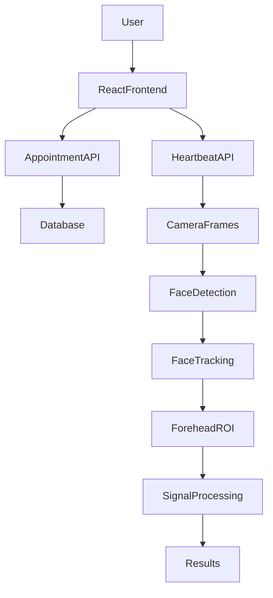
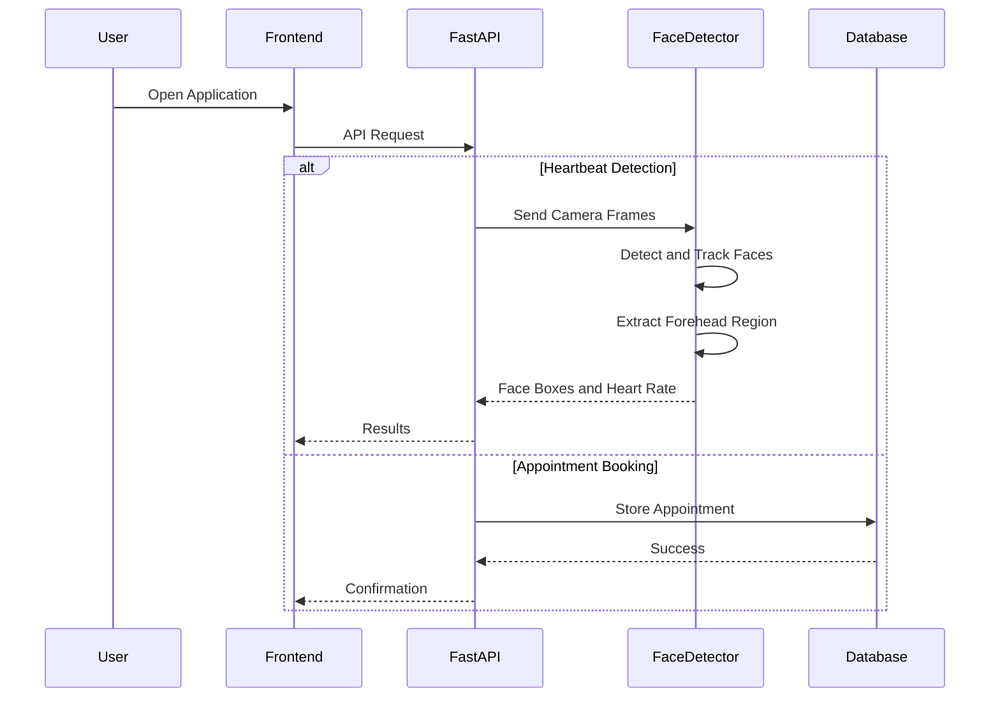

# 🩺 Smart Healthcare Management System

> **An AI-powered Healthcare Management Platform built on Real-time Face Detection, delivering contactless Heartbeat Monitoring and Doctor Appointment Management.**

[](https://react.dev/)
[](https://vitejs.dev/)
[](https://fastapi.tiangolo.com/)
[](https://opencv.org/)
[](https://docs.opencv.org/4.x/db/d28/tutorial_cascade_classifier.html)
[](https://python.org/)
[](LICENSE)

A modern healthcare platform whose core is a **real-time face detection engine**. Faces are located in the live camera feed, tracked frame to frame, and used to isolate the forehead region from which the heart rate is estimated — entirely contactless. Alongside this, the platform provides a seamless experience for booking and managing doctor appointments.

---

# 🌟 Overview

The Smart Healthcare Management System is designed to improve accessibility to healthcare services by integrating two essential modules into one platform.

- 🙂 Real-time Face Detection & Multi-Face Tracking
- ❤️ Contactless Heartbeat Estimation from the detected face
- 🏥 Doctor Appointment Booking & Management

Detecting Heartbeat per sec by face detection is the foundation of the health module: no face, no signal. Every heart rate reading begins with locating and locking onto a face.

The frontend is built with **React + Vite**, while the backend uses **FastAPI**, enabling fast API responses and scalable architecture.

---

# ✨ Key Features

## 🙂 Face Detection & Tracking

- Haar Cascade Face Detection
- Multi-Face Detection in a Single Frame
- Per-Face Identity Tracking Across Frames
- Centroid-Distance Face Matching
- Automatic Timeout for Faces That Leave the Frame
- Grayscale + Histogram Equalization Pre-processing
- Live Face and Forehead Bounding Box Overlays
- Colour-Coded Labels per Detected Face

---

## ❤️ AI Heartbeat Detection

- Forehead Region Extracted from Each Detected Face
- Real-time Heart Rate Monitoring
- Camera-based Pulse Detection
- Live Frame Processing
- Per-Face BPM Results
- Session-based Detection
- FastAPI Background Processing

---

## 🏥 Appointment Management

- Book Doctor Appointments
- View All Appointments
- Manage Scheduled Visits
- Dashboard for Appointment Tracking

---

## 💻 Frontend Features

- Modern Responsive UI
- React Router Navigation
- Live Camera Scan Modal
- Real-time API Integration
- Interactive Components
- Clean Healthcare Dashboard

---

## ⚡ Backend Features

- RESTful FastAPI APIs
- OpenCV Face Detection Pipeline
- Multi-Face Tracker Management
- SQLAlchemy Database
- Modular API Structure
- Background Task Processing

---

# 🛠 Tech Stack

| Category | Technologies |
|-----------|--------------|
| Frontend | React 19, Vite, React Router |
| Styling | Tailwind CSS 4 |
| Backend | FastAPI |
| Language | Python |
| Database | SQLite + SQLAlchemy |
| Computer Vision | OpenCV |
| Face Detection | Haar Cascade Classifier |
| Face Tracking | Centroid Distance Matching |
| Signal Processing | FFT, Hamming Window |
| Data Processing | NumPy |
| Visualization | Matplotlib |
| Testing | PyTest |

---

# 🏗 System Architecture



---

# 🔄 Application Workflow



---

# ⚙️ How It Works

## 🙂 Face Detection Pipeline

1. Camera frame is converted to grayscale.

2. Histogram equalization normalizes lighting.

3. Haar Cascade classifier scans the frame.

4. Multi-scale detection returns all face rectangles.

5. Regions below the minimum size are rejected.

6. Each face rectangle is drawn on the output frame.

---

## 🎯 Face Tracking

1. Detected faces are matched to existing trackers.

2. Matching uses distance between face centers.

3. Matched faces keep their existing face ID.

4. Unmatched faces receive a new tracker and colour.

5. Faces missing beyond the timeout are removed.

6. Each tracked face maintains its own signal buffer.

---

## ❤️ Heartbeat Detection Module

1. User starts heartbeat scan.

2. Camera captures live frames.

3. Frames are sent to FastAPI.

4. Face detection locates every face.

5. Forehead region is derived from the face box.

6. Mean colour intensity is sampled per frame.

7. Signal is interpolated, windowed and detrended.

8. FFT extracts the dominant frequency.

9. Peak within the valid BPM band becomes the heart rate.

10. Heart rate is returned to frontend per face.

---

## 🏥 Appointment Module

1. User selects doctor.

2. Chooses appointment details.

3. Request is sent to backend.

4. Appointment is stored in database.

5. Dashboard displays appointment history.

---

# 📁 Folder Structure

```text
Healthcare-Management-System
│
├── Frontend
│   ├── src
│   │   ├── api
│   │   ├── components
│   │   ├── pages
│   │   ├── sections
│   │   ├── App.jsx
│   │   └── main.jsx
│   │
│   ├── public
│   └── package.json
│
├── Backend
│   ├── api
│   │   ├── appointments.py
│   │   ├── heartbeat_service.py
│   │   ├── frame_session.py
│   │   ├── db.py
│   │   ├── models.py
│   │   └── main.py
│   │
│   ├── lib
│   │   ├── processors.py
│   │   ├── device.py
│   │   └── interface.py
│   │
│   ├── tests
│   ├── haarcascade_frontalface_alt.xml
│   ├── get_pulse.py
│   ├── requirements.txt
│   └── app.db
│
└── README.md
```

---

# 📂 Folder Explanation

## 📁 Frontend

Contains the React application.

### api/

Handles API communication with FastAPI.

### components/

Reusable UI components.

Examples:

- Heartbeat Checker
- Scan Modal
- Results Component

### pages/

Application pages.

- Appointment Booking
- Appointment Dashboard

### sections/

Landing page UI

- Hero
- Navbar
- Doctors
- Footer

---

## 📁 Backend

Contains FastAPI server.

### api/

REST APIs for

- Face Detection Scan
- Heartbeat Detection
- Appointments
- Database
- Session Management

### lib/

Core face detection and pulse processing algorithms.

- processors.py — face detector, face trackers, BPM estimation
- device.py — camera access and frame capture
- interface.py — display and drawing helpers

### haarcascade_frontalface_alt.xml

Pre-trained Haar Cascade model used to detect frontal faces.

### tests/

Unit testing modules.

---

# 📡 API Modules

## 🙂 Face Detection APIs

- Start Face Detection Session
- Stream Camera Frames
- Return Detected Face Regions
- Track Faces Across Frames

---

## ❤️ Heartbeat APIs

- Start Heartbeat Scan
- Process Frames
- Get Heartbeat Result
- Manage Detection Session

---

## 🏥 Appointment APIs

- Create Appointment
- View Appointments
- Update Appointment
- Delete Appointment

---

# 🚀 Installation

## Clone Repository

```bash
git clone https://github.com/anishkumar51555/Healthcare-Management-System.git
```

## Frontend

```bash
cd Frontend
npm install
npm run dev
```

Runs on

```
http://localhost:5173
```

---

## Backend

```bash
cd Backend
pip install -r requirements.txt

uvicorn api.main:app --reload
```

Runs on

```
http://localhost:8000
```

---

# 🔐 Environment

Python 3.10+

Node.js 22+

Webcam access is required for face detection.

Good, even lighting improves detection accuracy.

---

# 📸 Demo

Recommended video flow (90–120 seconds)

- Landing Page
- Face Detection Scan
- Live Face and Forehead Bounding Boxes
- Multiple Faces Detected Together
- Heart Rate Results
- Appointment Booking
- Appointment Dashboard
- Backend APIs (Swagger)
- Database Entries

---

# 💡 Future Improvements

- Deep Learning Face Detector (DNN / MediaPipe)
- Facial Landmark-based ROI Selection
- Face Recognition for Patient Identity
- Improved Tracking Under Head Movement
- User Authentication
- Doctor Login Portal
- Patient Dashboard
- Medical History
- AI Health Recommendations
- Email Notifications
- Video Consultation
- Cloud Database
- Docker Deployment
- CI/CD Pipeline

---

# 🤝 Contributing

Contributions are welcome!

1. Fork the repository

2. Create a feature branch

```bash
git checkout -b feature/new-feature
```

3. Commit changes

```bash
git commit -m "Add new feature"
```

4. Push changes

```bash
git push origin feature/new-feature
```

5. Open a Pull Request

---

# 📄 License

Distributed under the MIT License.

---

# 👨‍💻 Author

**Anish Kumar**

GitHub: https://github.com/anishkumar51555

If you found this project useful, consider giving it a ⭐.
